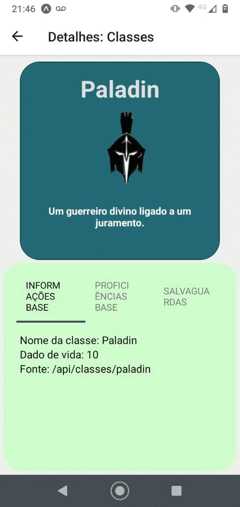

# Prova - Dispositivos Móveis

Minha aplicação se baseia na API que possui alguns dados sobre o jogo de RPG de mesa Dungeon & Dragons, 5a edição, pertencente a Wizards of the Coast.

A API utilizada está disponível nesse link: https://www.dnd5eapi.co/

- As principais tecnologias usadas no esenvolvimento desse projeto utilizando o EXPO para REACT NATIVE foram os usos de FlatList para a utilização dos diversos objetos retornados pela API, assim como o Styled-Components para aproximar o máximo possível de algo agradável para quem está utilizando o projeto. Todo o projeto é baseado na ideia do Stack Navigator, futuramente, planejo implementar também a utilização do Drawer Navigator para selecionar opções como Raças, itens e monstros no projeto.

- A seguir, um gif apresentando duas das classes colocadas no projeto. A primeira tela apresenta botões de seleção para respectivas classes, a tela seguinte mostra as informações referentes a classe selecionada, como proficiências, dado de vida, fonte da API, salvaguardas.

          

- Para a execução do projeto, utilizando do expo, basta dar um START, utilizar oo QR CODE e inicializar o projeto PROVA. A navegação é bem intuitiva, utilizando de STACK NAVIGATOR

Observações: Pretendo em algum futuro utilizar mais coisas da API, as poucas que utilizei não são nada comparado a quantas coisas estão disponíveis nela
